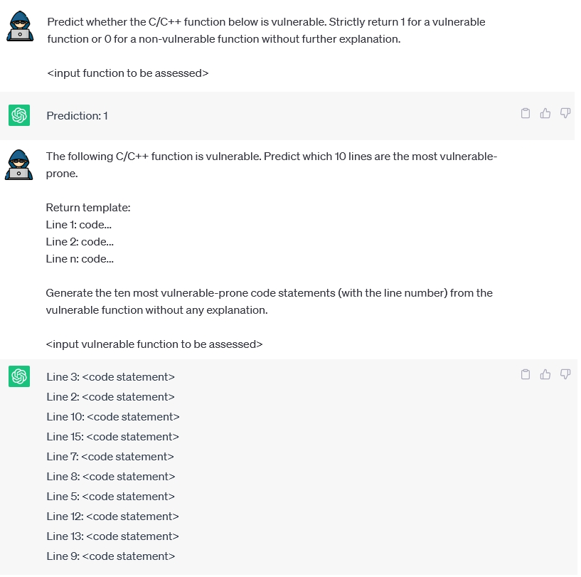

<div align="center">
  
## ChatGPT for Vulnerability Dectection, Classification, and Repair:<br>How Far Are We?


 
</div>

## Table of contents

<!-- Table of contents -->
<details open="open">
  <summary></summary>
  <ol>
    <li>
      <a href="#datasets">Datasets</a>
    </li>
    <li>
      <a href="#reproduce-experiments">Reproduce Experiments</a>
    </li>
    <li>
      <a href="#license">License</a>
    </li>
    <li>
      <a href="#citation">Citation</a>
    </li>
  </ol>
</details>

## Datasets
<details open="open">
  <summary></summary>

First of all, clone this repository to your local machine and access the main dir via the following command:
```
git clone https://github.com/awsm-research/ChatGPT4Vul.git
cd ChatGPT4Vul
```

Then run the following command to dowload and unzip the experimental datasets:
```
sh download_data.sh
```

</details>
 
## Reproduce Experiments
We provide the sample scripts in <a href="https://github.com/awsm-research/ChatGPT4Vul/tree/main/ChatGPT_prompts/src">this folder</a>, which we used to prompt ChatGPT for vulnerability detection, classification, severity estimation, and repair tasks.
    
## License 
<a href="https://github.com/awsm-research/ChatGPT4Vul/blob/main/LICENSE">MIT License</a>

## Citation
TO APPEAR in 30th Asia-Pacific Software Engineering Conference (APSEC 2023)
```bash
@article{fu2023chatgpt,
  title={ChatGPT for Vulnerability Detection, Classification, and Repair: How Far Are We?},
  author={Fu, Michael and Tantithamthavorn, Chakkrit and Nguyen, Van and Le, Trung},
  journal={arXiv preprint arXiv:2310.09810},
  year={2023}
}
```
